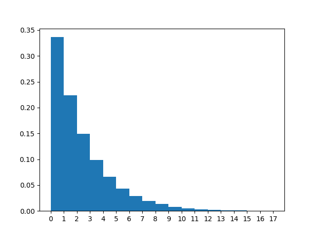
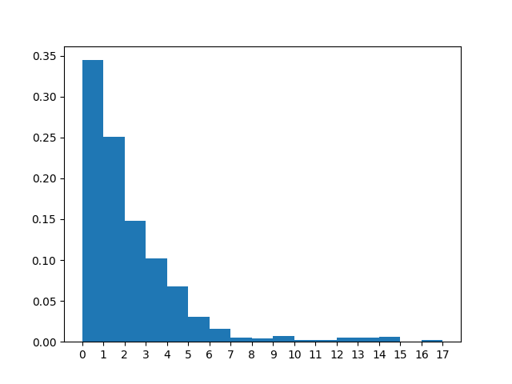

# Статистика
λ = 2.00

μ = 3.00

n = 1

|                  |   count |     mean |      std |   min |   25% |   50% |   75% |   max |
|:-----------------|--------:|---------:|---------:|------:|------:|------:|------:|------:|
| Размер очереди   |   49456 | 1.15782  | 2.23733  |     0 |     0 |     0 |     2 |    16 |
| Занятые каналы   |   49456 | 0.655552 | 0.475193 |     0 |     0 |     1 |     1 |     1 |
| Заявки в системе |   49456 | 1.81337  | 2.45542  |     0 |     0 |     1 |     3 |    17 |

Всего отменено: 0

Всего выполнено: 1000

Теоретические вероятности для состояний системы:

Практические вероятности для состояний системы:

|                           |        0 |        1 |        2 |         3 |         4 |         5 |         6 |          7 |          8 |          9 |         10 |         11 |         12 |         13 |         14 |          15 |         16 |         17 |
|:--------------------------|---------:|---------:|---------:|----------:|----------:|----------:|----------:|-----------:|-----------:|-----------:|-----------:|-----------:|-----------:|-----------:|-----------:|------------:|-----------:|-----------:|
| Теоретическая вероятность | 0.333333 | 0.222222 | 0.148148 | 0.0987654 | 0.0658436 | 0.0438957 | 0.0292638 | 0.0195092  | 0.0130061  | 0.00867076 | 0.00578051 | 0.00385367 | 0.00256912 | 0.00171274 | 0.00114183 | 0.000761219 | 0.00050748 | 0.00033832 |
| Практическая вероятность  | 0.344448 | 0.251031 | 0.147929 | 0.101929  | 0.0680605 | 0.0307951 | 0.0159536 | 0.00469104 | 0.00430686 | 0.0067737  | 0.0025275  | 0.0019209  | 0.00549984 | 0.00511566 | 0.00624798 | 0.00052572  | 0.0019209  | 0.00032352 |

|                                      |    Теор. |   Практ. |
|:-------------------------------------|---------:|---------:|
| Вероятность отказа                   | 0        | 0        |
| Относительная пропускная способность | 1        | 1        |
| Абсолютная пропускная способность    | 2        | 2        |
| Длина очереди                        | 1.33333  | 1.15782  |
| Количество занятых каналов           | 0.666667 | 0.655552 |
| Количество заявок в системе          | 2        | 1.81337  |

|                         |   count |    mean |     std |   min |    25% |   50% |   75% |   max |
|:------------------------|--------:|--------:|--------:|------:|-------:|------:|------:|------:|
| Время запроса в очереди |    1000 | 0.57261 | 1.01424 |  0    | 0      | 0.165 |  0.77 |  7.12 |
| Время запроса в системе |    1000 | 0.89682 | 1.07491 |  0.01 | 0.2375 | 0.58  |  1.15 |  7.29 |

|                                                 |   Значение |
|:------------------------------------------------|-----------:|
| Теор. среднее время пребывания заявки в очереди |   0.666667 |
| Теор. среднее время пребывания заявки в СМО     |   1        |

|                                         |   Значение |
|:----------------------------------------|-----------:|
| Сумма штрафа за сутки при S = 10 рублей |      72.48 |

